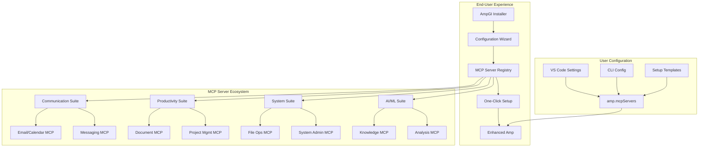

Transform Amp into a general-purpose agent through end-user extensibility using MCP servers and configuration.

## Vision

Enable **any Amp user** to extend their installation into a comprehensive general-purpose agent without requiring access to Amp's source code. Users configure MCP servers through Amp's existing extensibility mechanisms to add capabilities for communication, document management, system automation, and more.
## Architecture Overview



  

## Core Strategy: MCP-Based Extension Ecosystem

  

**Key Insight:** Amp already has the perfect architecture for this via MCP servers. Users can extend Amp by installing and configuring MCP servers without touching Amp's source code.

  

## Phase 1: MCP Server Library Development

  

### Communication & Collaboration Tools

  

**Example Configuration:**

```json

{

"gmail": {

"command": "npx",

"args": ["ampgi-email-mcp", "--provider=gmail"],

"env": { "GMAIL_CREDENTIALS": "path/to/oauth.json" }

}

}

```

  

**Planned MCP Servers:**

- **ampgi-email-mcp**: Gmail, Outlook, IMAP/SMTP integration

- Send/receive emails

- Email organization and filtering

- Attachment handling

- Template management

  

- **ampgi-calendar-mcp**: Google Calendar, Outlook Calendar, CalDAV

- Event scheduling and management

- Meeting coordination

- Availability checking

- Reminder automation

  

- **ampgi-messaging-mcp**: Slack, Teams, Discord automation

- Message sending and monitoring

- Channel management

- Bot interactions

- Status updates

  

- **ampgi-video-mcp**: Zoom, Meet scheduling and management

- Meeting creation and invites

- Recording management

- Participant coordination

  

### Document & File Management

  

**Example Configuration:**

```json

{

"documents": {

"command": "npx",

"args": ["ampgi-docs-mcp"],

"env": {

"GOOGLE_DRIVE_CREDS": "...",

"DROPBOX_TOKEN": "..."

}

}

}

```

  

**Planned MCP Servers:**

- **ampgi-docs-mcp**: PDF, Word, Excel processing

- Document creation and editing

- Format conversion

- Content extraction and analysis

- Template application

  

- **ampgi-cloud-mcp**: Google Drive, Dropbox, OneDrive

- File synchronization

- Sharing and permissions

- Backup automation

- Storage optimization

  

- **ampgi-convert-mcp**: Format conversion, OCR, compression

- Image/document conversion

- Text extraction from images

- File compression and archiving

- Batch processing

  

### System & Automation Tools

  

**Example Configuration:**

```json

{

"automation": {

"command": "npx",

"args": ["ampgi-automation-mcp", "--safe-mode"]

}

}

```

  

**Planned MCP Servers:**

- **ampgi-database-mcp**: SQL/NoSQL database operations

- Query execution and optimization

- Schema management

- Data migration and backup

- Performance monitoring

  

- **ampgi-api-mcp**: REST/GraphQL API interactions

- API discovery and testing

- Automated integration setup

- Response parsing and transformation

- Rate limiting and error handling

  

- **ampgi-automation-mcp**: Workflow and task automation

- Trigger-based actions

- Cross-platform integrations

- Scheduled task execution

- Error recovery and retries

  

- **ampgi-monitor-mcp**: System monitoring and alerts

- Health checks and uptime monitoring

- Performance metric collection

- Alert configuration and delivery

- Log analysis and reporting

  

## Phase 2: AmpGI Setup Experience

  

### Installation Method 1: NPM Package

```bash

npm install -g ampgi-setup

ampgi-setup install --profile=personal

```

  

**What it does:**

1. Analyzes user's Amp installation (VS Code vs CLI)

2. Presents capability selection menu

3. Installs chosen MCP servers

4. Configures `amp.mcpServers` automatically

5. Provides usage examples and documentation

  

### Installation Method 2: Configuration Templates

```bash

curl -s https://ampgi.io/configs/full-suite.json > ~/.ampgi-config.json

ampgi-setup apply ~/.ampgi-config.json

```

  

**Pre-built profiles:**

- **Personal Assistant**: Email, calendar, documents, notes

- **Business Productivity**: Project management, CRM, analytics

- **Developer Plus**: Existing coding tools + deployment, monitoring

- **Research Assistant**: Knowledge management, data analysis

- **Content Creator**: Social media, content planning, publishing

  

### Installation Method 3: VS Code Extension

- AmpGI companion extension with GUI for MCP server management

- Marketplace for discovering and installing MCP servers

- One-click capability enablement

- Configuration backup and sharing

  

## Phase 3: User Experience Flow

  

### Discovery & Installation

1. **Learn about AmpGI** via documentation site

2. **Choose installation method** (NPM, manual config, VS Code extension)

3. **Select capabilities** from curated list or custom

4. **Authenticate services** through guided OAuth flows

5. **Test functionality** with example tasks

  

### Daily Usage Examples

  

**Meeting Management:**

```

User: "Schedule a meeting with John next Tuesday at 2pm and send him the agenda"

Amp: [uses calendar MCP + email MCP to schedule and notify]

```

  

**Project Analysis:**

```

User: "Analyze my project's GitHub issues and create a status report"

Amp: [uses GitHub MCP + document MCP to fetch data and generate report]

```

  

**File Organization:**

```

User: "Backup my important documents to Dropbox and organize them by date"

Amp: [uses cloud MCP + file organization MCP]

```

  

**Content Creation:**

```

User: "Create a blog post about our latest feature and schedule it for next week"

Amp: [uses content MCP + scheduling MCP + social media MCP]

```

  

## Implementation Roadmap

  

### Week 1-2: Proof of Concept

- [ ] Build **ampgi-email-mcp** server with basic Gmail integration

- [ ] Create simple installer script

- [ ] Test with manual VS Code configuration

- [ ] Document basic setup process

  

### Month 1: Core MCP Servers

- [ ] Complete email, calendar, and document MCP servers

- [ ] Build configuration wizard

- [ ] Create documentation site and setup guides

- [ ] Implement basic authentication flows

  

### Month 2: User Experience

- [ ] Develop AmpGI installer CLI tool

- [ ] Create VS Code companion extension

- [ ] Build pre-configured templates for common use cases

- [ ] Add configuration validation and testing

  

### Month 3: Ecosystem Growth

- [ ] Release MCP server development kit

- [ ] Create community contribution guidelines

- [ ] Build MCP server marketplace/registry

- [ ] Establish security review process

  

### Month 4+: Advanced Capabilities

- [ ] Context persistence across MCP servers

- [ ] Cross-server workflows and automation

- [ ] Advanced security and permission management

- [ ] Analytics and usage insights

- [ ] Enterprise features and deployment options

  

## Technical Architecture

  

### MCP Server Standards

```typescript

interface AmpGIMCPServer {

name: string

description: string

capabilities: string[]

requirements: {

auth?: 'oauth' | 'api-key' | 'none'

dependencies?: string[]

permissions?: string[]

}

installation: {

command: string

args: string[]

env?: Record<string, string>

}

}

```

  

### Configuration Management

- **Secure credential storage** via OS keychain integration

- **Configuration validation** before MCP server launch

- **Automatic updates** for MCP servers

- **Rollback capability** for failed configurations

  

### Safety & Security

- **Sandboxed execution** of MCP servers

- **Permission-based access** to sensitive operations

- **Audit logging** of all MCP server actions

- **User consent flows** for high-privilege operations

  

## Example User Configuration

  

### Full AmpGI Setup

```json

{

"amp.mcpServers": {

"gmail": {

"command": "npx",

"args": ["ampgi-email-mcp", "--provider=gmail"],

"env": { "GMAIL_CREDENTIALS": "~/.ampgi/gmail-oauth.json" }

},

"gcal": {

"command": "npx",

"args": ["ampgi-calendar-mcp", "--provider=google"],

"env": { "GOOGLE_CALENDAR_CREDS": "~/.ampgi/gcal-oauth.json" }

},

"gdrive": {

"command": "npx",

"args": ["ampgi-cloud-mcp", "--provider=gdrive"],

"env": { "GOOGLE_DRIVE_CREDS": "~/.ampgi/gdrive-oauth.json" }

},

"slack": {

"command": "npx",

"args": ["ampgi-messaging-mcp", "--provider=slack"],

"env": { "SLACK_BOT_TOKEN": "~/.ampgi/slack-token" }

},

"automation": {

"command": "npx",

"args": ["ampgi-automation-mcp", "--safe-mode"],

"env": { "AMPGI_WORKSPACE": "~/.ampgi/workspace" }

}

}

}

```

  

## Success Metrics

  

### User Adoption

- Number of AmpGI installations

- Most popular MCP server combinations

- User retention and engagement metrics

- Community contributions to MCP ecosystem

  

### Capability Coverage

- Breadth of supported services and platforms

- Depth of integration per service

- User task completion rates

- Error rates and reliability metrics

  

### Developer Experience

- Time from idea to working MCP server

- Documentation completeness and clarity

- Community support and responsiveness

- Security review and approval times

  

## Benefits

  

### For End Users

- **No coding required**: Simple configuration-based setup

- **Modular approach**: Add only needed capabilities

- **Secure by design**: Sandboxed execution and permission controls

- **Community-driven**: Benefit from shared MCP server ecosystem

  

### For Amp

- **Ecosystem growth**: Expands Amp's usefulness without core changes

- **Community engagement**: Creates opportunities for user contributions

- **Market expansion**: Attracts non-developer users

- **Reduced maintenance**: Community maintains MCP servers

  

### For Developers

- **Clear APIs**: Standardized MCP server development

- **Reusable components**: Build on existing MCP infrastructure

- **Distribution platform**: Easy sharing and discovery

- **Monetization opportunities**: Premium MCP servers and services

  

This approach transforms Amp into a general-purpose agent entirely through end-user configuration and external MCP servers, requiring no changes to Amp itself while providing a rich ecosystem of capabilities.